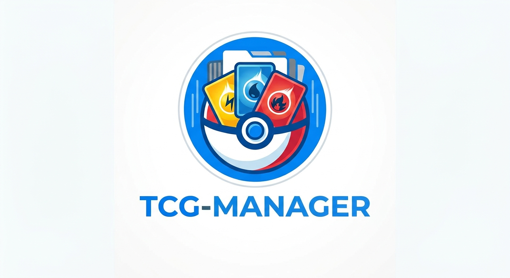

  

  # TCG Manager

  **Application web (PWA) de scan, gestion et cotation de cartes Pokémon TCG en temps réel.**

---

## 📱 À propos

**TCG Manager** est une Progressive Web App (PWA) conçue pour faciliter le suivi de votre collection de cartes Pokémon. Grâce à l'analyse d'image par IA et aux API du marché, l'application identifie vos cartes, récupère leurs cotes actuelles et permet de gérer votre stock par finition.

---

## ✨ Fonctionnalités principales

- **📸 Scan par IA :** Capturez votre carte avec l'appareil photo pour l'analyser et l'identifier instantanément.
- **💶 Cotes en temps réel :** Récupération automatique des prix du marché (en € et $) via **TCGdex** et **Pokémon TCG API** (Cardmarket / TCGplayer).
- **✨ Gestion multi-finitions :** Suivez séparément vos exemplaires selon leur version (**Normal**, **Reverse**, **Holo**).
- **📊 Suivi de valeur :** Calcul automatique de la valeur totale estimée de votre collection.
- **💾 Sauvegarde & Restauration (100 % locale) :** Exportez et importez votre base de données au format `.json` pour conserver vos données en sécurité.
- **📱 PWA & Offline-First :** Installable sur iOS et Android comme une application native depuis le navigateur.

---

## 🚀 Installation & Utilisation

### En tant qu'utilisateur
1. Ouvrez l'application dans votre navigateur mobile (Safari sur iOS, Chrome sur Android).
2. Sélectionnez **« Ajouter à l'écran d'accueil »** pour l'installer.
3. Autorisez l'accès à la caméra lors du premier scan.

### Pour le développement local

1. **Cloner le projet :**
   git clone https://github.com/votre-utilisateur/tcg-manager.git
   cd tcg-manager

2. **Structure des fichiers :**
   index.html        # Interface globale & logique applicative
   logo.jpg          # Visuel principal de l'application
   manifest.json     # Configuration PWA
   sw.js             # Service Worker
   api/scan.js       # Endpoint serverless pour l'analyse d'image IA

3. **Lancement :**
   Déployez le projet sur un hébergeur compatible avec les fonctions serverless (Vercel, Netlify) ou lancez un serveur local :
   npx serve .

---

## 🛠️ Technologies utilisées

- **Frontend :** HTML5, CSS3, JavaScript (ES6)
- **Base de données locale :** IndexedDB via Dexie.js
- **Données TCG & Cotes :** TCGdex API / Pokémon TCG API
- **PWA :** Service Workers & Web App Manifest

---

## 💾 Sauvegarde des données

L'application utilise la mémoire locale de votre navigateur. Effectuez régulièrement un **export JSON** depuis l'onglet *Ma Collection* pour sauvegarder votre progression :
- **Exporter JSON :** Génère un fichier `.json` horodaté.
- **Importer JSON :** Restaure votre collection sur un nouvel appareil ou navigateur.

---

## 📄 Licence

Projet distribué sous licence MIT.
